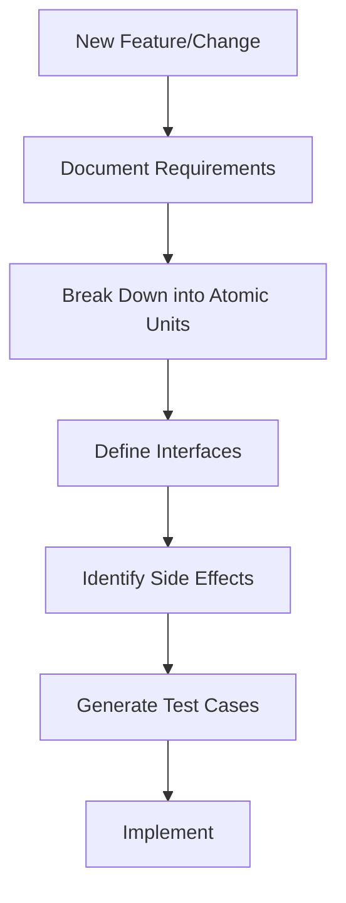

# AI-Assisted Development Strategy

## Principles

### 1. Atomic Design

- Break down features into the smallest possible units.
- Each component should have a single responsibility.
- Minimize dependencies between components.
- Use clear interfaces for communication.

### 2. Documentation First

Before implementing any feature:

- Document the interface.
- Define expected behaviors.
- List potential side effects.
- Specify error conditions.

### 3. Code Organization

Follow these steps when adding new code:

1. Define public interfaces.
2. Document expected behavior.
3. Break down into atomic units.
4. Add comprehensive tests.
5. Implement the smallest unit first.

### 4. LLM Consultation Process

Before making changes:



### 5. Code Review Checklist

- [ ] Is each component atomic?
- [ ] Are interfaces well-defined?
- [ ] Are side effects documented?
- [ ] Is error handling comprehensive?
- [ ] Are tests complete?

### 6. Project Structure Guidelines

```plaintext
src/
├── domain/           # Business logic
│   ├── entities/     # Core types
│   ├── interfaces/   # Trait definitions
│   └── services/     # Business operations
├── infrastructure/   # External services
├── presentation/     # API layer
└── utils/            # Shared utilities

tests/
├── unit/             # Unit tests
├── integration/      # Integration tests
└── property/         # Property-based tests
```

### 7. Testing Strategy

#### Test Structure
