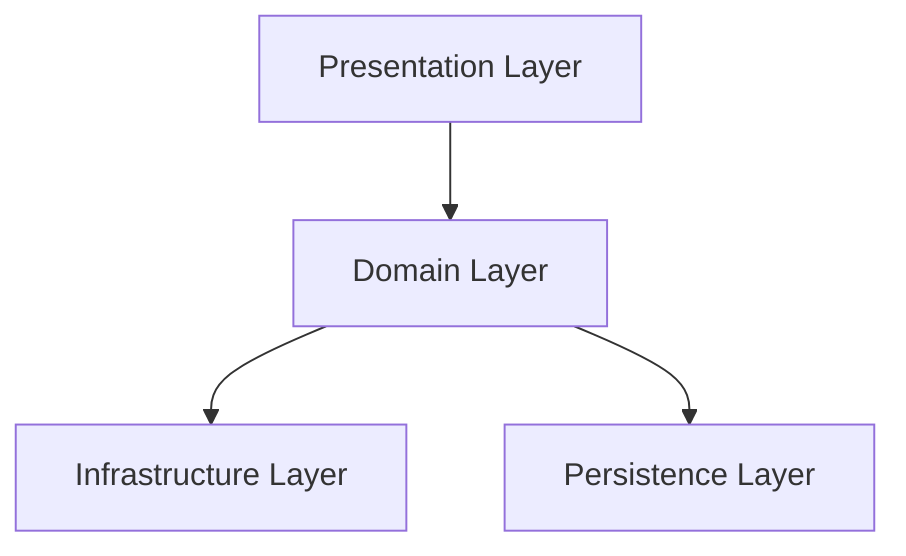

# Architecture Documentation

## Core Principles

### 1. Atomic Design
Each component should be:
- Independent
- Single-purpose
- Well-defined interface
- Minimal side effects

### 2. Layer Separation



### 3. Component Architecture

Each component must have:
```rust
pub trait ComponentInterface {
    // Required behaviors
    fn operation(&self) -> Result<Output, Error>;
    
    // Error conditions
    fn validate(&self) -> Result<(), Error>;
    
    // Side effects
    fn get_side_effects(&self) -> Vec<SideEffect>;
}
```

### 4. Error Handling Strategy

- Use custom error types
- Document all possible errors
- Handle errors at boundaries
- Provide context

### 5. Testing Strategy

- Unit tests for atomic components
- Integration tests for boundaries
- Property-based tests for invariants
- Mutation tests for coverage quality
